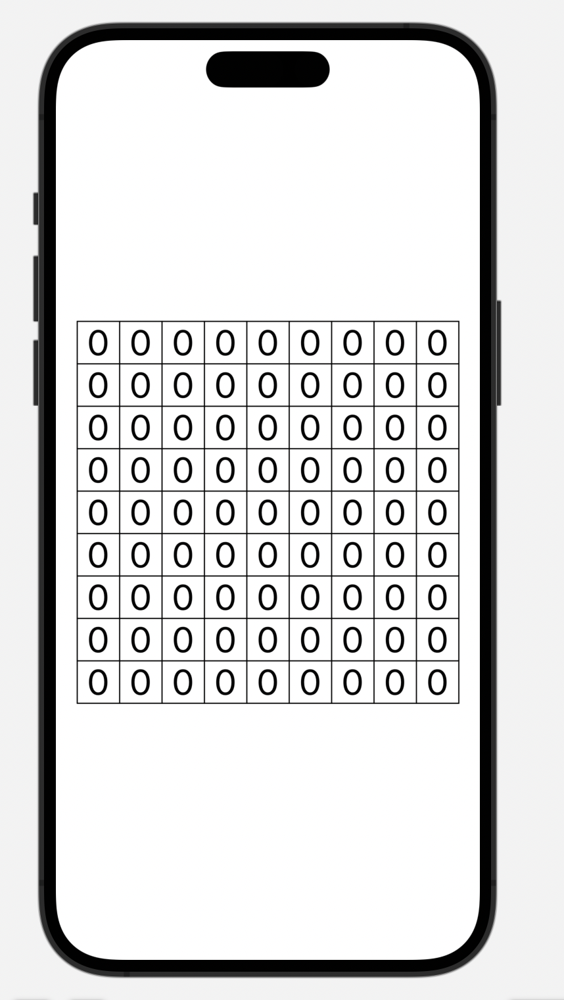
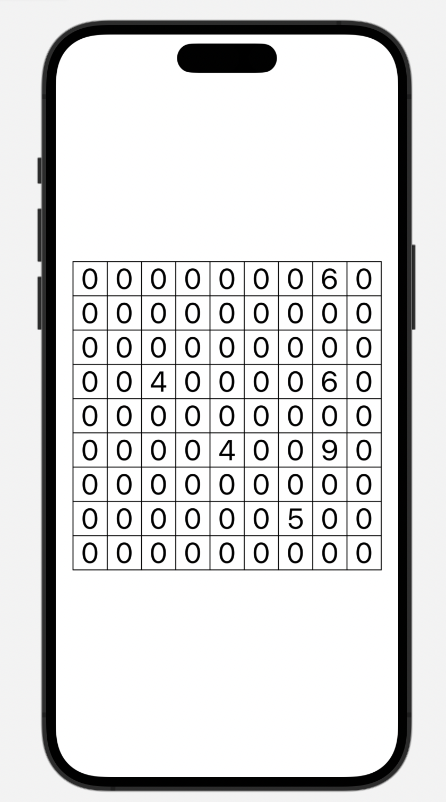

# GridTap: A UI Challenge Project

## Introduction

The `GridTap` Challenge showcases the evolution of a simple SwiftUI grid app through two versions: `NumGrid` and `TapGrid`. Starting as a non-interactive numerical grid, it has been enhanced to an interactive app that responds to user taps, with each cell tracking the number of taps. 

## Features
- **Dynamic Grid Layout**: Generates a 9x9 grid that automatically adjusts to fit the screen.

- **Interactive Cells**: `TapGrid` version introduces a tap gesture for each cell, with the number incrementing with each tap.

- **Adaptive Font Sizing**: Custom algorithm to dynamically calculate the font size for each cell to optimize readability and space utilization.

- **SwiftUI Implementation**: Built entirely using SwiftUI, demonstrating modern iOS development practices.

- **State Management**: Utilizes SwiftUI's @State property wrapper to update the UI dynamically based on user interaction.

## Installation

Clone the repository to get both `NumGrid` and `TapGrid`:

```bash
git clone https://github.com/ddeerrrriicckk/GridTap.git
cd GridTap
```

Navigate to the respective project directories and open the Xcode project file:

```bash
open NumGrid.xcodeproj
# or
open TapGrid.xcodeproj
```

## Usage
Run the desired version from Xcode. `NumGrid` provides a static view of the numerical grid, while `TapGrid` allows you to interact with the grid cells.

## Code Examples

### NumGrid
The `NumGrid` version of the app features a non-interactive grid where the font size is dynamically calculated to fit within the cells, regardless of the device's screen size.

```
func calculateFontSize(for text: String, in size: CGSize) -> CGFloat {
    let attributes: [NSAttributedString.Key: Any] = [.font: UIFont.systemFont(ofSize: 1)]
    let strSize = text.size(withAttributes: attributes)
    let scaleFactor = min(size.width / strSize.width, size.height / strSize.height)
    return 1 * scaleFactor
}
```

### TapGrid
In the `TapGrid` iteration, the grid becomes interactive. Cells keep track of taps, incrementing their displayed number with each tap and resetting after a certain threshold.

```
.onTapGesture {
    counts[row][col] += 1
    if counts[row][col] > 9 {
        counts[row][col] = 0
    }
}
```

## Visuals

<p float="left">
  
  
</p>


